**The University of Melbourne**
# COMP30019 – Graphics and Interaction

Final Electronic Submission (project): **4pm, Fri. 6 November**

Do not forget **One member** of your group must submit a text file to the LMS (Canvas) by the due date which includes the commit ID of your final submission.

You can add a link to your Gameplay Video here but you must have already submit it by **4pm, Sun. 25 October**

# Project-2 README

## Table of contents
* [Team Members and Contributions](#team-members-and-contributions)
* [Explanation of the game](#explanation-of-the-game)
* [How objects and entities were modelled](#how-objects-and-entities-were-modelled)
* [How the graphics pipeline and camera motion was handled](#how-the-graphics-pipeline-and-camera-motion-was-handled)
* [How the shaders work](#how-the-shaders-work)
* [Querying and evaluation](#querying-and-evaluation)
* [Technologies](#technologies)
* [References](#references)

## Team Members and Contributions

| Name | Tasks | State |
| :---         |     :---:      |          ---: |
| Xiaochen Hou    | Fish Movements and Hook Detection, Hook Operations, Player Spawning     |  Done |
| Jackson Hu    | Fish Spawning, Level Selection Menu, Pause Button, Gameplay Video     |  Done |
| Luke Hawkins    | Fishing, Player and Camera Movement, Shaders, Level Complete UI     |  Done |
| Jessica Hammer  | Sound Effects, Main Menu, Score and Timer, Island Layout, Particle Effects     |  Done |

Everyone took part in the user evaluation process, general testing, coming up with ideas/solutions to problems. During the whole process we used a Trello board to keep track of the things that needed to be done, and who is doing them. Here is a screenshot of the board when we were nearing completion with the game:

<p align="center">
  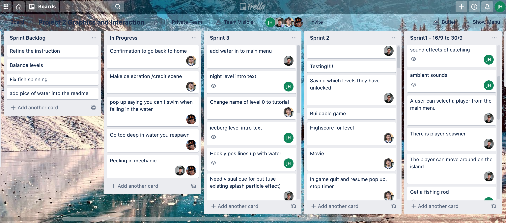
</p>

## Explanation of the game
This game is a 3rd-person top-down fishing game with a few different levels. The aim of the game is to catch a certain amount of fish within the time limit, and progress through the levels.

### How to use it
This game is intended to be played with a keyboard and mouse. Once the main menu appears, click `Start` to play. You can also view the instructions of the game or quit the application.

<p align="center">
  
</p>

Then, select which level you would like to play. At the start, only one level will be avaliable to select. The other levels become unlocked as you progress through the game.

<p align="center">
  
</p>

When you are in the level, it is time to start catching some fish. Keep an eye on the timer, because if not enough fishing score you get by the time the clock reaches zero then you fail the level. The fishing score can be seen in the top left of the screen (the number on the right), as well as the fishing score you've currently got (the number on the left).

<p align="center">
  
</p>

In order to catch fish you may want to move the player to get a better look at the water. Use the `WASD` keys to move and point with the `Mouse` the direction you want to look at. If you are looking in the direction of a fish, then left click, hold, and release to cast the fishing rod. The longer you hold down left click the further out the line will be cast. Once the fish bites (when you hear the sound effect) then click again to pull the fish back in.

<p align="center">
  
  
</p>

* If you didn't catch the required number of fish before the timer ends, the menu will pop up telling you failed to complete the current level and unable to unlock the next level. Feel free to click the `Retry` button to have another shot.
* Otherwise, the level completion menu will pop up. Click the `Next` button to go to the next level, or `Retry` if you want to try again and beat your record.

<p align="center">
  
  
</p>

## How objects and entities were modelled
Overall, our vision for the aesthetic of the game was a simple cartoony style. We decided to stick to a low poly style as best as we could, since it has the potential to look really good and it is not as taxing on the computer (due to smaller vertex counts). Furthermore, if certain assets we wanted were not available online then modelling our own (with unfortunately limited artistic skills) was an option because of the simplicity of the style. 

### Models
The following objects were modelled (by Jess) from scratch in Blender: The fish, the player, the fishing rod, and the island shape.

<p align="center">
  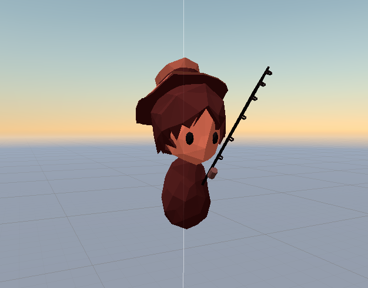
  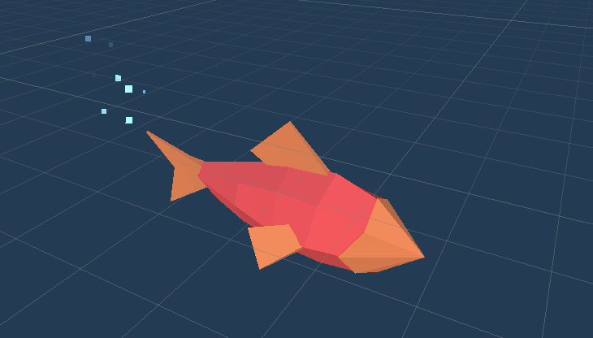
  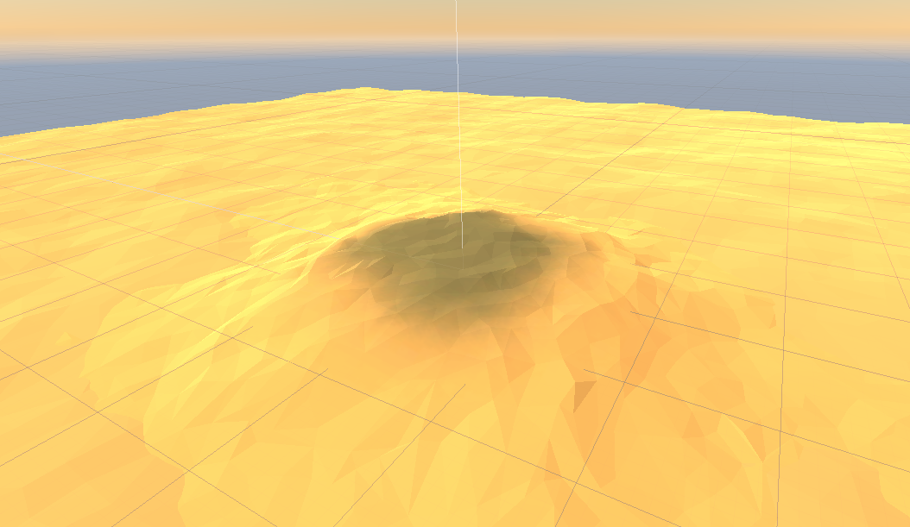
</p>

The modelling process for these objects began with creating primitive meshes in blender such as cylinders, planes and spheres. They were then sculpted into the desired shape using Blender's intuitive sculpting tools. The final trick to making the models low-poly was to apply the 'Decimate' modifier. This removes some amount of vertices and condenses the mesh into simpler shapes. The models were then exported out of blender as a .fbx and imported into Unity. Since .fbx files contain material data as well, the colours of the models could then be adjusted in Unity as desired by modifying the material colour for each mesh. For example, the fish adjust their colour at runtime to create some variation in the models. We decided to go with very natural colours like brown, green and blue because not only is our game set outdoors in nature, but those colours are also calming to look at. 

The water, sadly, was one of the exceptions to the low poly aesthetic because although possible to create, it required the geometry shader to look good, which is not always supported (for example on Macs). The water shader will be discussed in detail later. 

The rest of the main assets (skybox, trees, grass, shells, font) were from the asset store (see references) and were chosen primarily because of their simple, low-poly style and colours. **Talk about how these assets make the world feel real and makes it more emmersive**

### Lighting
The lighting was another important factor that helped to tie objects in the whole scene together. By setting the ambient light to a light pink colour, this got rid of muddy shadows and gave the screen a slight cool tint. A directional light in each scene then provided some shadows for a bit of extra dimension.

### UI
**Colour**  
We also made our own panels for the UI since we wanted the buttons to have a round shape which feels more natural. We chose to stick with a brown theme for the UI since it is a neutral colour that is also consistent with the environment (island) colour. The colour combination we chose for the UI elements are basically light brown as background and dark brown for the contents and border which avoided any colours may cause eye fatigue (e.g. green & red).

<p align="center">
  
  
</p>

For the buttons and pop-up windows, we implemented round shape and highlighted colour. Contrast colour was used to indicate the element is interactable, for instance, the text will turn to primrose yellow when the cursor is hovering over the button. The `Timer` would also turn to red when the time reaches ten or less. The red colour is really suitable to attract player's attention and send a warning about time limit.

<p align="center">
  
</p>

**Game Design Convention**  
We followed the conventions of game design for our UI elements. The `Pause` and `Home` buttons were represented with pause icon on music player and home icon to avoid any misunderstanding. A few `Fish icons` were embeded near the fishing score to convey clear information to the player as well.

<p align="center">
  
  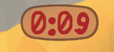
  
</p>

**Element Layout**  
In order to prevent the player from clicking the `Home` button during the game accidently, we implemented a pop-up window asking for the confirmation. This was one of the improvements we made after the user evaluation process because several testers clicked the `Home` button by mistake and the level should start over again. 
The buttons in the Main Menu and Level Selection were placed at the left side under the game title. The right side was the preview of our island which makes it very clear to the player where the buttons are. Also the camera transition and animations on the background provided an enjoyable and immersive experience. The button layout during the game was at the corner of screen. For example, the `Pause` and `Home` buttons were placed on the upper right corner which is easy to reach.

### Sound
The sound effects/music were mostly sourced from the internet (see references) with post-processing adjustments made in Logic Pro. It was often the case where sound clips had to be spliced, faded out or combined to produce the final result. Reverb, spread and equalisation was also sometimes added. A few sound effects (fish collection sound, level completion sound) were made from scratch. We tried to keep the sound effects sounding natural, avoiding synthy electronic sounds. **Talk about how sounds convey actions or events**

### Particle effects
 The first particle effects we added are bubbles and splashes. These both help to really convey the feeling of water.

<p align="center">
  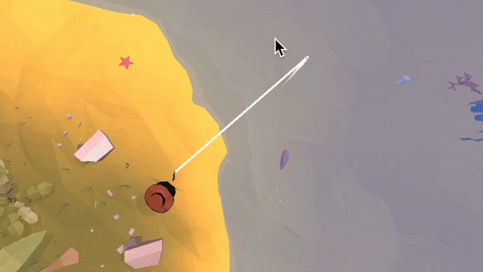
  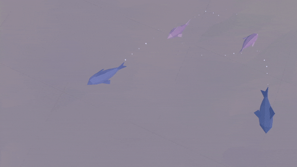
</p>

The bubbles shoot particles behind the fish to give them some extra life and also so it is slightly easier to see them (for example on the night level). The direction of the particles changes automatically with the fishes direction since the particle system is a child of the fish it is attached to. The particles have negative gravity so they slowly rise upwards and they are set to generate in world space so it leaves more of a trail.

The splash is used when the hook lands in the water, and when the fish bites, giving clear visual feedback to the player that an interaction has happened between these objects. An accompanying splash sound is also played to complete the effect. The splash was made by setting the particle system to generating particles in a cone shape while being affected by gravity, then tweaking the values until it looked right. We also feel it is appropriate to mention how and why we spawned in the splash effect the way we did. We could have attached the particle effect as a child to the hook object, and then controlled the play and pause from a script, but this turned out to have multiple problems associated with it. This is because the hook gameobject gets deleted when the player reels in, but the splash should still continue on. So instead the splash particle effect (and sound) was made in to a prefab, and when the hook hits the water it spawns in this prefab game object in the position of the hook but NOT as a child. The particle effect and sound are set to play on start. Then the prefab has a ```Delay``` and ```DestroyGameobject``` script attached so it can self-delete when it is done playing the particle effect. This way, not only are the issues from before solved but it is also incredibly versatile and re-useable. This technique of spawning in prefabs and having them self-delete was also used for some other object such as the +1 particle effect.

We used the same sprite for both effects: the default square sprite. This was chosen because the hard edges matched with our style the best (rather than a soft circle). In both effects the opacity was faded out nearing the end of their lifespan so there was a smooth transition for when the effect dissapeared.

The other main particle effect is the +1 particle effect (it can do other numbers too!).

<p align="center">
  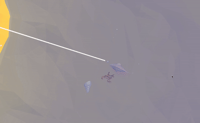
</p>

This particle effect has a separate camera that is looking at a text object somewhere in the scene, and then a ```RenderTexture``` is made from that, and that is what the particle effect uses for its material. This way the text is still a text object, NOT a photo, and so its text can be edited to any number we like. The purpose of this particle effect is to clearly indicate that the player's score increases, and with different amounts for different fish.

## How the graphics pipeline and camera motion was handled

### Camera motion
The camera was positioned above looking down on the the main focus of the scene, eg the player or the hook.
The camera movement was then smoothed when the target moved or switched from one object to another, this gives the player more intuition about how things are placed in the world. An example of this use is in the Tutorial scenes where the camera looks at a fish and then pans back to the player, allowing them to know which direction the fish is in.
This was create using an automatic camera control method. The method was to have a target Transform, eg the Player, and the initial offset from that transform and the camera was used as the offset to then aim for. Then the camera position is Lerped towards target position (transforms position + offset) creating a smooth movement.

Our reasoning behind using an automatic control, was to guide the player on what they should be currently looking at, creating more intuitive experience.


## How the shaders work
### Water Shader
This shader does a variety of effects to achieve the look of water.

<p align="center">
  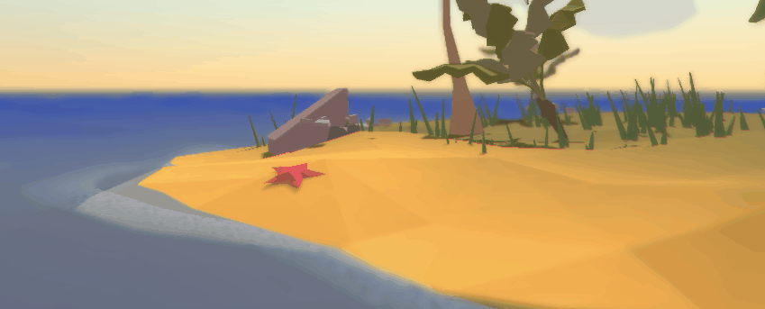
</p>

<p align="center">
  
</p>

#### Diffuse Colouring
The colouring of the water is broken up into shallow and deep, these colours are used to change the colour of the water depending on the depth provided by the height map.

#### Waves Displacement
With the use of a third party noise function "Bcc8NoiseClassic" provided by Keijiro, a displacement to the water is added in the vertex shader. This was parameterised by its intensity, frequency and movement direction.

#### Foam Waves
This effect creates a wave of foam that rocks up onto the shore. This was create by taking slices of the height map and then moving the slices up over time. Then a texture was overlayed on top to create some visual interest. Lastly the strength of this effect was increased as the water got shallower.

#### Height Map
The height map was an integral part of making this shader work, although it was implement as a Script. At the start of the scene the HeightMapGenerator Script shoots a grid of raycasts down on the terrain to deduce its height, this is then mapped into an image for the shader to use. 

#### Why a Shader?
The main reason for this to be done on the shader was for efficiency and quality. If dynamic water was to be implemented in a Script it would require us to create/alter a new texture every frame, that would stretch across all the water, this would require a massive texture to not look grainy. Instead, with the use of a shader, this can be done in parallel and in screen space, only requiring the pixels that will be visible in the camera frustum to be computed, resulting in higher performance and better quality.  

#### FlatShaded Water (old)


### Wiggle Shader
#### Displacement
The wiggle shader displaces the vertices of the model to make it look like it is wiggling/swimming. This is done by using `_Time` in a sin function. It was parametrised to take a speed, intensity and frequency value for the movement.

#### Why a Shader?
The reason we opted to have this be done on the GPU instead of CPU was for efficiency. Since there may be many objects all with this shader, all displacing each of their vertices, it makes practical sense to have all these done in parallel, as each vertex displacement is independent of one another.

#### Its purpose
The use of this shader in this scene does 2 important things. 1 it brings the fish model to life, and helps convey the message that these are fish. 2 It can be reused on many different models without the use rigging each model individually, saving time, eg the trees.

<p align="center">
  
</p>

<p align="center">
  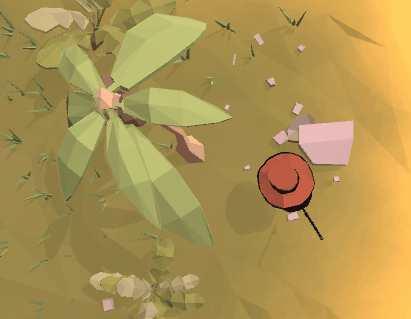
</p>

## Querying and evaluation
### Querying and observational methods
#### Observational Method: Cooperative Evaluation
We chose Cooperative Evaluation for our Observational Method. We figure that this technique would have advantanges over Think Aloud as this gave us the ability to clarify and have a dialog about the game, it was also easier to use which we needed as a lot of our testers were over Zoom.  We used a mix of recording data styles; we recorded the screen and audio and used paper and pencil for notes if there was time.

7 participants:

The testing procedure went as follows: 
1. Send them a copy of the game (if online)
2. Started a zoom session and recorded the zoom session (if online)
3. They started to play the game, while we watched and occasionally asked questions
4. What the player did in the game that was of interest was noted.
5. What the player said was also noted.
6. If the user was unable to complete a level, we showed them to the "Unlock All" button. This turned out to be a huge success, as some players could not complete level 2 but could complete level 3.
7. The recording and notes were uploaded to shared google drive.

#### Querying Method: Interviews
We chose Interviews for our Querying Method. This we chose over Questionnaires as it required less work for the tester and we did not need any other documents sent to them. This

6 particpants

The testing procedure went as follows: 
1. Send them a copy of the game (if online)
2. Started a zoom session and recorded the zoom session (if online)
3. They started to play the game, while we didn't watch.
6. If we came back and saw they were stuck we told them about the "Unlock All" button.
7. Afterwards we used predetermined questions to ask them and noted down there answers
8. The conversation was allowed to stray from the questions, and we noted these down as well.
9. After the tester left, the recording was watched again and anything of interest was noted.
8. The recording and notes were uploaded to shared google drive.

Description of the querying and observational methods used, including: description of the participants (how many, demographics), description of the methodology (which techniques did you use, what did you have participants do, how did you record the data), and feedback gathered.

### Documentation of changes
Thankfully though, it seemed like in general our users knew what to do and the game was entertaining for them. But there were a lot of issues that came up. So firstly, we collated everyone's results using a Google Jamboard. 

<p align="center">
  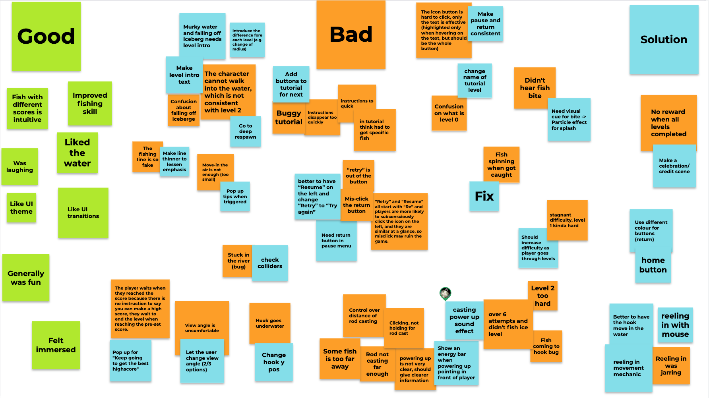
</p>

Then, we put the information in a table and ordered it by priority. We prioritised the things further up the top of the list, they were commonly a problem to all the users. This included things like visual bugs, levels being way too hard or user misunderstandings with some features. 

| Solution | Problem | State |
| :---         |     :---:      |          ---: |
|Balance levels by changing number of fish, time limit, distance to fish| Could not complete level 2 but finished level 3 in first go | |
|Fix fish spinning| Fish would spin around when biting hook | Done |
|Night level intro text| The user got confused why they could not see the fish | Done |
|Iceberg level intro text| The user got confused when they feel off iceberg| Done |
|Need visual cue for bite (particle effect splash)| The user didn't hear biting sound | Done |
|Add buttons for tutorial popups, instead of timers and button queues| The users broke or missed parts of the tutorial from clicking to early | Done |
|Change name of level 0 to tutorial| Was confused what level 0 meant | Done |
|Show Casting power by making the forward direction indicator grow| Control of rod distance was difficult | Done |
|Casting power up sound effect| Control of rod distance was difficult | Done |
|Pop up for “keep going to get the best high score”| Player stopped playing once level threshold was reached | Done |
|Goto to deep in water, respawn| Player was confused why they couldn't walk in water and then confused about that they could fall off iceberg| |
|Pop up saying you can’t swim when fall in water| Player confused what happened when they fell off iceberg| |
|Make pause and button more consistent | The button did not change colour when hovered over and user didn't think they were buttons| Done |
|Return button as home icon| Was confused at what the home button did from the icon| Done |
|Make a celebration / credit scene| Felt unexcited when game finished and went back to main menu| |
|Check hook y pos lines up with water| The hook went underwater and the player thought the fish wasn't biting the hook| Done |
|Reeling in mechanic| The player felt that the reeling in was jarring and that the game was to hard| |
|Confirmation to go back to home| The player accidentally clicked the back button instead of pause| Done |

## Technologies
Project is created with:
* Unity 2019.4.3f1

## References
The following assets that we used in the game are NOT ours.

### Models
Rocks from: Low Poly Rock Pack by Broken Vector, Unity Asset Store\
Trees (and a skybox): POLY STYLE Vegetation Pack by Singularity Art Studio, Unity Asset Store\
Grass, small rocks from: Simplistic low poly nature by Acorn Bringer, Unity Asset Store\
Skybox from: Customizable skybox by Key Mouse, Unity Asset Store\
Main font used from: Bubble font (free version) by Jazz Create Games, Unity Asset Store

### Sound effects
Fishing cast: https://www.youtube.com/watch?v=pjHdbABLkTY and https://www.youtube.com/watch?v=mD58V881Jdk combined together\
Beach ambience: https://freesound.org/people/inchadney/sounds/66046/ \
Crickets: https://freesound.org/people/reinsamba/sounds/58235/ \
Menu music: https://soundimage.org/quiet-peaceful-mellow/ Key West Sunset\
UI SFX: https://soundimage.org/sfx-ui/ \
More UI SFX: https://freesound.org/people/audioninja001/sounds/328991/ \
Collect fish sound: Tune made in Logic Pro by Jess and https://freesound.org/people/InspectorJ/sounds/421184/ combined together\
Fish bite sound: https://freesound.org/people/InspectorJ/sounds/398711/ and https://freesound.org/people/qubodup/sounds/210426/ \
Splash: https://freesound.org/people/InspectorJ/sounds/416710/ \
Level fail tune: https://freesound.org/people/florianreichelt/sounds/412427/ \
Footsteps: https://www.youtube.com/watch?v=-RKQEJbjXx0&list=PL9u1QIXS8ctglTKbKt9o87wNwMUolkQZX and https://freesound.org/people/soundmary/sounds/194992/

### Code/Scripts
Camera depth of focus/vignette shader effect from: POLY STYLE Vegetation Pack by Singularity Art Studio, Unity Asset Store \
Bcc8NoiseClassic from <a href="https://github.com/keijiro/NoiseShader">Noise Shader Library for Unity<a/>


